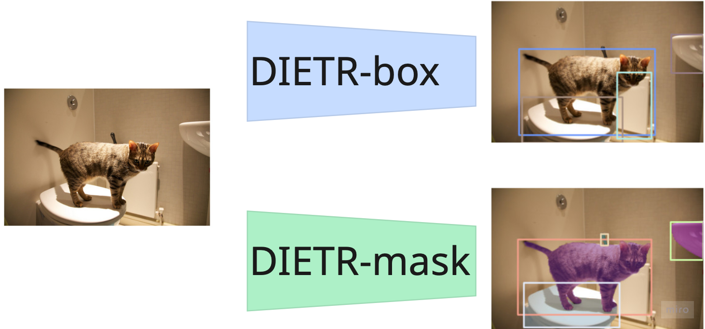
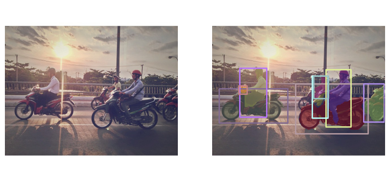
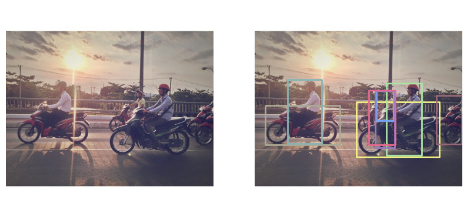

# DIETR
# Detection and Instance sEgmentation TRansformers


`DIETR` is a toolbox that contains code to to train, validate and use the DIETR model, which comes in an instance segmentation `DIETR-msk` or an object detection `DIETR-box` variant. 

| Model     | AP-0.95 - box | AP-0.95 - msk | Trainable parameters |
| :----     | :----- |:----- |:-----: | 
| DIETR-box | 0.44 | / | 38,425,780|
| DIETR-msk | 0.45 | 0.377 | 41,816,244 |


# DIETR-msk
````python
from dietr.tools.dietr_wrapper import DIETRWrapper

conf_pth = "base-msk.yaml"
ckpt_pth = "dietr-msk.pt"
file_pth = "coco/images/val2017/000000534827.jpg"
model = DIETRWrapper( 
    conf_pth=conf_pth, 
    ckpt_pth=ckpt_pth,
    )
````

# DIETR-box
````python
from dietr.tools.dietr_wrapper import DIETRWrapper

conf_pth = "base-box.yaml"
ckpt_pth = "dietr-box.pt"
file_pth = "coco/images/val2017/000000534827.jpg"
model = DIETRWrapper( 
    conf_pth=conf_pth, 
    ckpt_pth=ckpt_pth,
    )
````


# Usage
Just clone it using git.
```bash
git clone https://github.com/JPABotermans/dietr.git
```

And install all dependencies using `uv`
```bash
uv sync
```
<details><summary> Install DIETR for cuda-toolkit versions</summary>

The default instalation installs the `nvidia-cudnn-cu13` wheel. If your driver doens't support that CUDA toolkit version (check by `nvidia-smi`) you can install different version using the following commands:

```bash
uv sync --extra cu128
```
For 12.1
```bash
uv sync --extra cu121
```
And for cpu only 
```bash
uv sync --extra cpu
```


</details>

# Training
Training 
```bash
uv run python \
    src/dietr/trn.py \
    __configs__/00-base-msk.yaml
```

# Validation
```bash
uv run python \
    src/dietr/val.py \
    __configs__/00-base-msk.yaml \
    --ckpt 00-dietr-msk.pt
```

# Acknowledgement
## [VBTI](https://www.vbti.nl)
<p align="center">
  <a href="https://www.vbti.nl/VBTI_flyer_consultancy.pdf"></a>
  <a href="https://www.vbti.nl/VBTI_flyer_agritech%20v2.pdf"></a>
  <a href="https://www.vbti.nl/VBTI_flyer_inspection_ADAM_One.pdf"></a>
</p>

As an AI engineer at [VBTI](https://www.vbti.nl), I have had the opportunity to work on systems where robots can cut leaves, assess part quality, and make dynamic decisions based on vision. In many of these applications, object detection and instance segmentation are essential building blocks. While they are often just one part of a much larger system, they play a key role in enabling intelligent automation.

What makes this project especially meaningful to me is that it was made possible by VBTI’s culture of innovation and trust. VBTI gave me the freedom, time, and resources to explore this idea over the course of more than a year, encouraging personal initiative and technical curiosity. Even more, the company has been supportive in allowing me to continue this work as an open-source project in my own time — something that reflects a genuine commitment to innovation, knowledge sharing, and supporting employees where possible.

I would also like to especially thank Albert van Breemen, whose creativity and mentorship were a constant source of inspiration.

## BOM and TU/e supercomputer center.


Futhermore I want to acknowledgement that this work was only possible due to the access granted to [SPIKE-1](https://supercomputing.tue.nl/spike-1/), the supercomputing initiative from the [de Brabantse Ontwikellings Maatshappij](https://www.bom.nl). This initiative gave me the possibility to train models on the newest DGX B200 platform. During the few months I had access to their system I could make more progress then the year before it. I espcially want to thank Hengjian Zhang, who onboarded me on the system and learned me how to work on such a state-of-the-art system.


## Futher
This work was build upon [RT-DETR](https://github.com/lyuwenyu/RT-DETR) (the head was based on their decoder), and the prototype network principle was based on the work of [yoloact](https://github.com/dbolya/yolact).